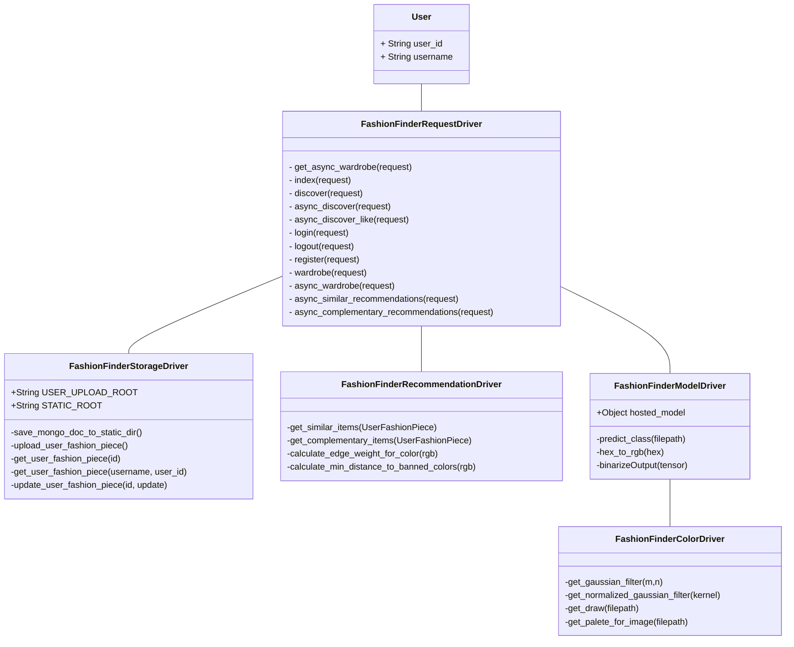

# Class Diagram of Django API and Machine Learning Backend

```mermaid
classDiagram
    class User {
        + String user_id
        + String username
    }
    class FashionFinderRequestDriver {
        - get_async_wardrobe(request)
        - index (request)
        - discover (request)
        - async_discover (request)
        - async_discover_like (request)
        - login (request)
        - logout (request)
        - register (request)
        - wardrobe (request)
        - async_wardrobe (request)
        - async_similar_recommendations(request)
        - async_complementary_recommendations(request)
    }

    class FashionFinderColorDriver{
        -get_gaussian_filter(m,n)
        -get_normalized_gaussian_filter(kernel)
        -get_draw(filepath)
        -get_palete_for_image(filepath)
    }

    class FashionFinderStorageDriver{
        +String USER_UPLOAD_ROOT
        +String STATIC_ROOT
        -save_mongo_doc_to_static_dir()
        -upload_user_fashion_piece()
        -get_user_fashion_piece(id)
        -get_user_fashion_piece(username, user_id)
        -update_user_fashion_piece(id, update)
    }

    class FashionFinderRecommendationDriver{
        -get_similar_items(UserFashionPiece)
        -get_complementary_items(UserFashionPiece)
        -calculate_edge_weight_for_color(rgb)
        -calculate_min_distance_to_banned_colors(rgb)
    }

    class FashionFinderModelDriver {
        +Object hosted_model
        -predict_class(filepath)
        -hex_to_rgb(hex)
        -binarizeOutput(tensor)
    }

    FashionFinderModelDriver -- FashionFinderColorDriver
    FashionFinderRequestDriver -- FashionFinderRecommendationDriver
    User -- FashionFinderRequestDriver
    FashionFinderRequestDriver -- FashionFinderModelDriver
    FashionFinderRequestDriver -- FashionFinderStorageDriver
```
