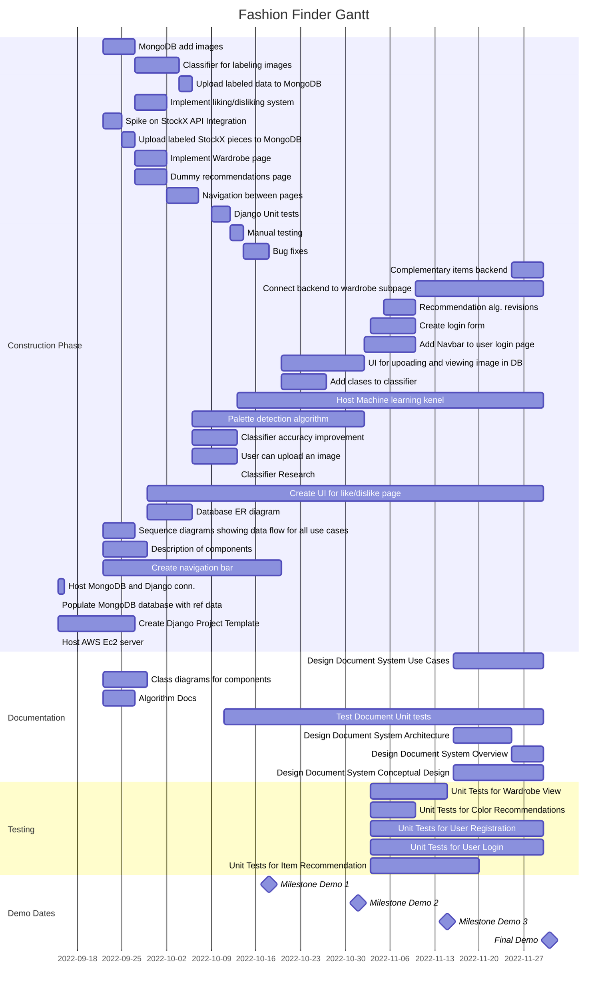

# Schedule

```mermaid

 gantt
    title Fashion Finder Gantt
    dateFormat  YYYY-MM-DD
   section Construction Phase
    MongoDB add images :         des5, 2022-09-22, 5d
    Classifier for labeling images: des51, after des5, 7d
    Upload labeled data to MongoDB: des52, after des51, 2d
    Implement liking/disliking system: des 6, after des5, 5d
    Spike on StockX API Integration: des7, 2022-09-22, 3d
    Upload labeled StockX pieces to MongoDB: des71,  after des7, 2d 
    Implement Wardrobe page: des53, after des5, 5d
    Dummy recommendations page: des72, after des71, 5d
    Navigation between pages: des8, after des53, 5d
    Django Unit tests: des9, 2022-10-09, 3d
    Manual testing: des10, after des9, 2d
    Bug fixes: after des10, 4d
    Complementary items backend: 2022-11-25, 2022-11-30
    Connect backend to wardrobe subpage: 2022-11-10,  2022-11-30
    Recommendation alg. revisions: 2022-11-05, 2022-11-10
    Create login form: 2022-11-03, 2022-11-10
    Add Navbar to user login page: 2022-11-02, 2022-11-10
    UI for upoading and viewing image in DB: 2022-10-20, 2022-11-02
    Add clases to classifier: 2022-10-20, 2022-10-27
    Host Machine learning kenel: 2022-10-13, 2022-11-30
    Palette detection algorithm: 2022-10-06, 2022-11-02
    Classifier accuracy improvement: 2022-10-06, 2022-10-13
    User can upload an image: 2022-10-06, 2022-10-13
    Classifier Research: 2022-09-29, 2022-10-13,
    Create UI for like/dislike page: 2022-09-29, 2022-11-30
    Database ER diagram: 2022-09-29, 2022-10-06
    Sequence diagrams showing data flow for all use cases: 2022-09-22, 2022-09-27
    Description of components:  2022-09-22, 2022-09-29
    Create navigation bar: 2022-09-22, 2022-10-20
    Host MongoDB and Django conn.: 2022-09-15, 2022-09-16
    Populate MongoDB database with ref data: 2022-09-15, 2022-10-4
    Create Django Project Template: 2022-09-15, 2022-09-27
    Host AWS Ec2 server: 2022-09-15, 2022-10-5

  section Documentation
    Design Document System Use Cases: 2022-11-16,  2022-11-30
    Class diagrams for components: 2022-09-22, 2022-09-29
    Algorithm Docs: 2022-09-22, 2022-09-27
    Test Document Unit tests:  2022-10-11, 2022-11-30
    Design Document System Architecture: 2022-11-16,  2022-11-25
    Design Document System Overview: 2022-11-25,  2022-11-30
    Design Document System Conceptual Design: 2022-11-16,  2022-11-30

  section Testing
    Unit Tests for Wardrobe View: 2022-11-03, 2022-11-15
    Unit Tests for Color Recommendations: 2022-11-03, 2022-11-10
    Unit Tests for User Registration: 2022-11-03, 2022-11-30
    Unit Tests for User Login: 2022-11-03, 2022-11-30
    Unit Tests for Item Recommendation: 2022-11-03, 2022-11-20
  section Demo Dates
    Milestone Demo 1                 :milestone, 2022-10-18, 0d
    Milestone Demo 2                 :milestone, 2022-11-01, 0d
    Milestone Demo 3                 :milestone, 2022-11-15, 0d
    Final Demo                   :milestone, 2022-12-01, 0d
```
