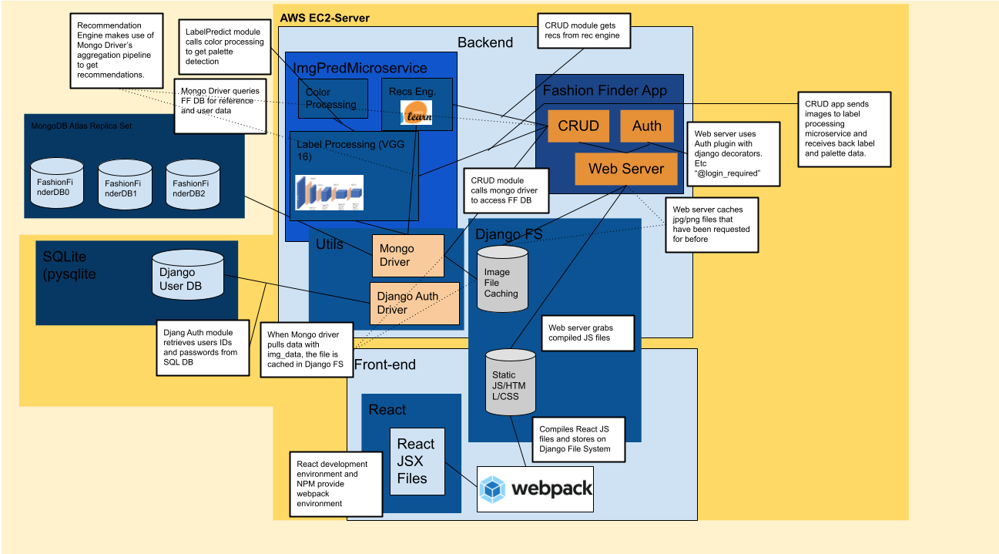

# System Block Diagram

As is discussed in the system overview, Django will handle Authentication, user uploads, and querying. MongoDB will store the User data and reference data, and it will provide the aggregations for user recommendations. Finally a combination of React.js and webpack is used to compile the frontend, which is served by Django.