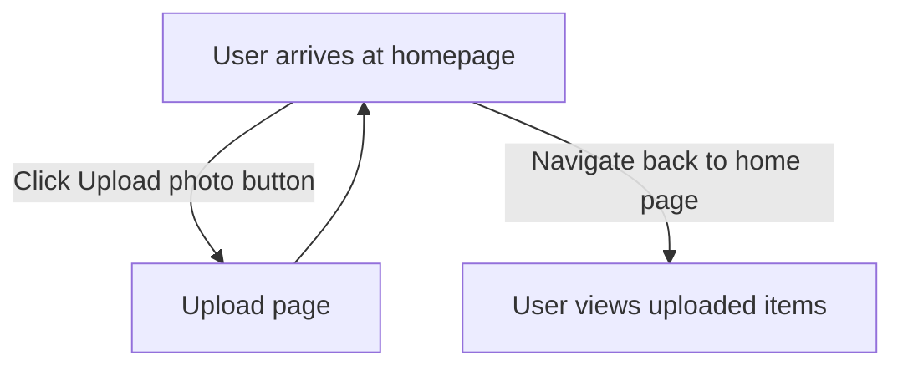
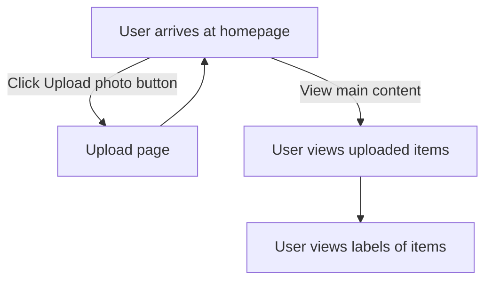
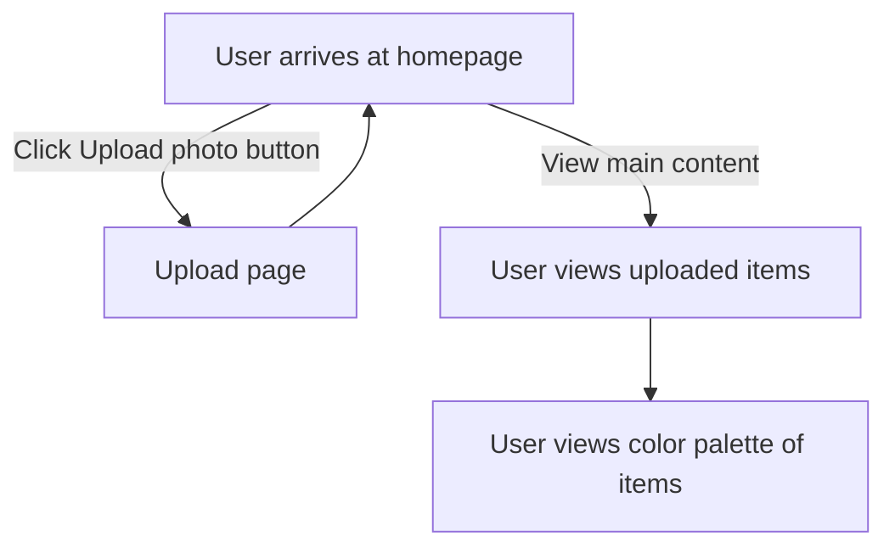
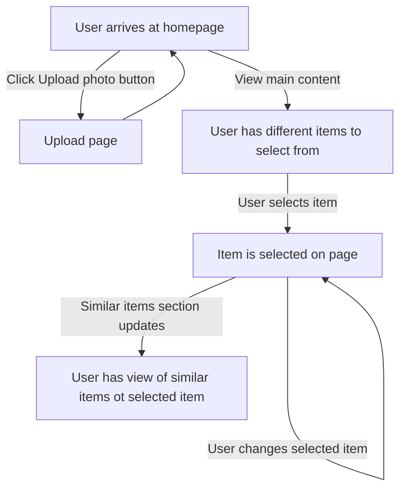
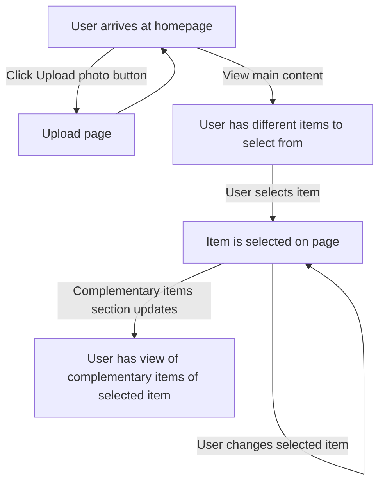
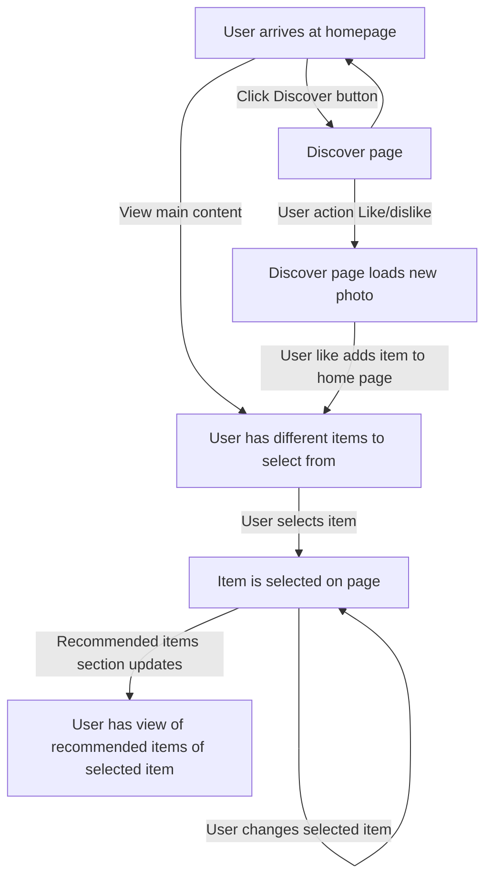

# Use-case descriptions

## Use case 1: Item tracker  

A user navigates to Fashion Finder and is fully authenticated
They want to keep track of clothes in their closet.
They uploads photos of each fashion piece they own.
The user is then able to view their uploaded pieces

## Use case 2: Item labeler

A user navigates to Fashion Finder and is fully authenticated
They have pictures of their closet and want to find out how many of each type of clothing they own
They upload photos of each fashion piece they own.
The user is then able to see their wardrobe with labels generated from a machine learning model
These labels will tell the user the type of clothing for each image uploaded 

## Use case 3: Color labeler

A user navigates to Fashion Finder and is fully authenticated
They have pictures of their closet and want to find out how often different colors appear in their wardrobe.
They upload photos of each fashion piece they own.
The user is then able to see their wardrobe with labels of the primary colors appearing in each photo.
These labels will tell the user the primary "palette" of the fashion piece.

## Use case 4: Finding similar items
A user navigates to Fashion Finder and is fully authenticated.
They have a fashion piece that they like and want to find more items like it.
They upload the fashion piece image to the Fashion Finder Database.
They navigate to a "See more like this" section, where they can see other fashion pieces in the same categories and fashion pieces with similar color palettes. 

## Use case 5: Finding complementary items
A user navigates to Fashion Finder and is fully authenticated.
They are able to view their wardrobe of uploaded items.
They want to be able to find other items that would go well with their item
For any of the items in their wardrobe, they can click on a "See items that would good well with this" section
They are then prompted with the most similar items, ranked by label similarity and color palette similarity. 

## Use case 6: Liking / Dislking items  
A user navigates to Fashion Finder and is fully authenticated.
They are able to navigate to a "Like/Dislike" page, where they will be prompted with random fashion pieces
They will be able to like or dislike different pieces
The user will be able to view a list of their liked pieces

.png)
