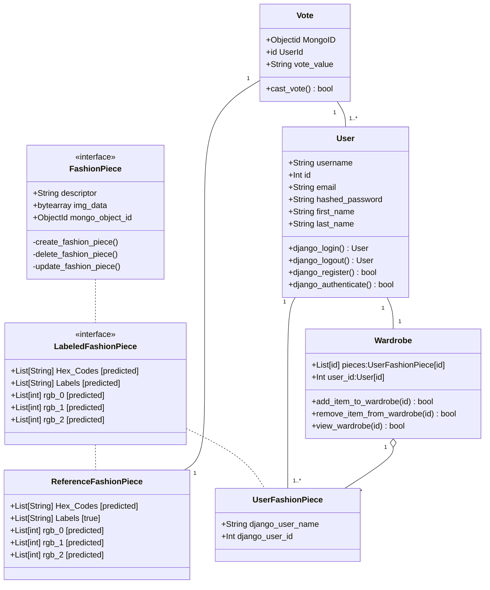

## Class Diagram for Django API Backend

The above diagram shows 1 Interface and 6 classes

### The **FashionPiece** interface
requires that the implementing class have a description, binary image data, and Mongo's ObjectID.

### The **LabeledFashionPiece** interface 
extends the **FashionPiece** interface. It also adds the attributes **Hex_Codes, labels, rgb_0, rgb_1 and rgb_2** which represent the labels and color palette. 

### The **ReferenceFashionPiece** class
implements the **LabeledFashionPiece** interface. It contains the same labels as **LabeledFashionPiece**, but its labels come directly from the Deep Fashion dataset labels, instead of the labels generated by the machine learning pipelines. Its color palette is predicted by the custom color palette detection algorithm.

### The **UserFashionPiece** class 
implements the **LabeledFashionPiece** interface. It adds the attributes **django_user_name** and **django_user_id**. These values represent the owner of the fashion piece.

### The **Wardrobe** class
tracks the fashion pieces that a user has uploaded for later retrieval. It is constructed as a mongoDB aggregation by grouping on the **django_user_name** and**django_user_id** in the **UserFahsionPiece** class.

### The **User** class
is a barebones implementation of the Django **User** class, with the attributes of **username, id, email, hashed_password, first_name and last_name**. It relies on the builtin `login()`, `logout()`, `autenticate()` and `register()` functions in the `django.auth` libary 

### The **Vote** class
is relationship class for tracking which users have liked which reference fashion pieces.

The **MongoID** field is a foreign key on the **ReferenceFashionPiece** id field.

The **UserId** field is a foreign key on the **User** id field
