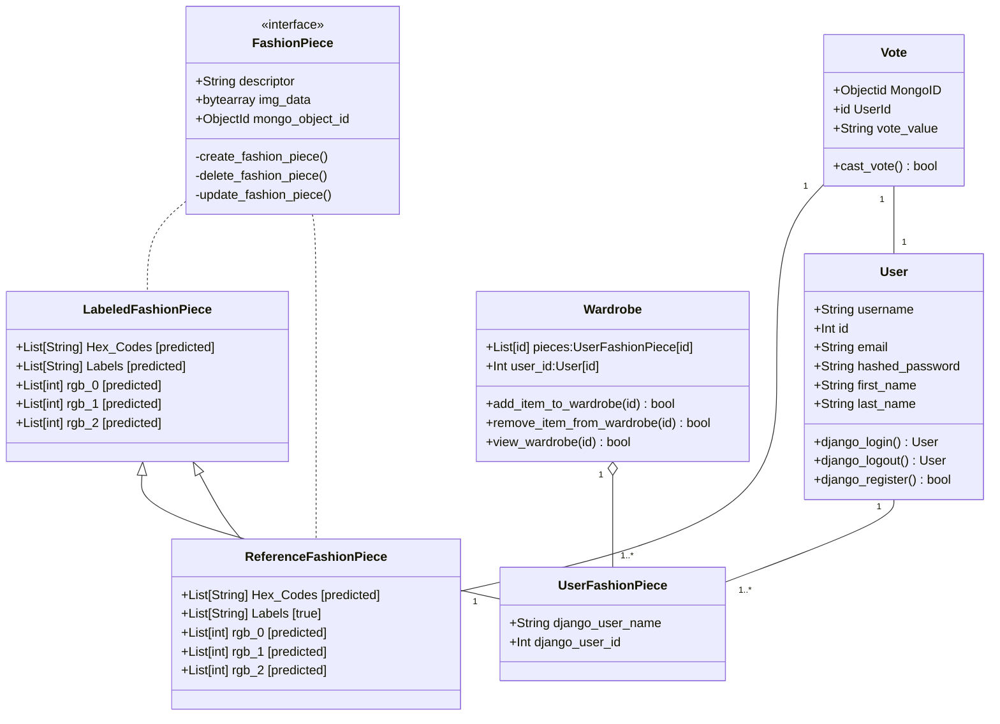

### Image Classification Class Diagram

```mermaid
classDiagram
    class FashionPiece {
      <<interface>>
      +String descriptor
      +bytearray img_data

      +ObjectId mongo_object_id
      -create_fashion_piece()
      -delete_fashion_piece()
      -update_fashion_piece()
    }
    %% Animal <|-- Duck
    %% Animal <|-- Fish

    FashionPiece .. LabeledFashionPiece
    FashionPiece .. ReferenceFashionPiece

    class LabeledFashionPiece {

      +List[String] Hex_Codes [predicted]
      +List[String] Labels [predicted]
      +List[int] rgb_0 [predicted]
      +List[int] rgb_1 [predicted]
      +List[int] rgb_2 [predicted]
    }
    LabeledFashionPiece <|-- UserFashionPiece

    class UserFashionPiece{
      +String django_user_name
      +Int django_user_id
    }
    LabeledFashionPiece <|-- ReferenceFashionPiece
    class ReferenceFashionPiece {
      +List[String] Hex_Codes [predicted]
      +List[String] Labels [true]
      +List[int] rgb_0 [predicted]
      +List[int] rgb_1 [predicted]
      +List[int] rgb_2 [predicted]
    }

    class User {
        +String username
        +Int id
        +String email
        +String hashed_password
        +String first_name
        +String last_name
        +django_login() User 
        +django_logout() User 
        +django_register() bool 
    }

    User "1" -- "1..*" UserFashionPiece 
    Wardrobe "1" o-- "1..*" UserFashionPiece 
    class Wardrobe {
        +List[id] pieces:UserFashionPiece[id]
        +Int user_id:User[id]
        +add_item_to_wardrobe(id) bool 
        +remove_item_from_wardrobe(id) bool 
        +view_wardrobe(id) bool 
    }

    class Vote {
        +Objectid MongoID
        +id UserId
        +String vote_value
        +cast_vote() bool
    }
    Vote "1" -- "1" ReferenceFashionPiece
    Vote "1" -- "1" User

```
