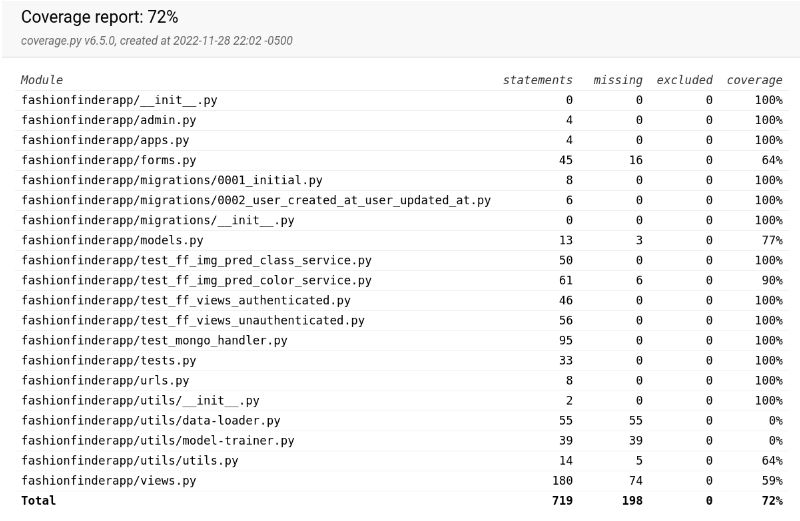
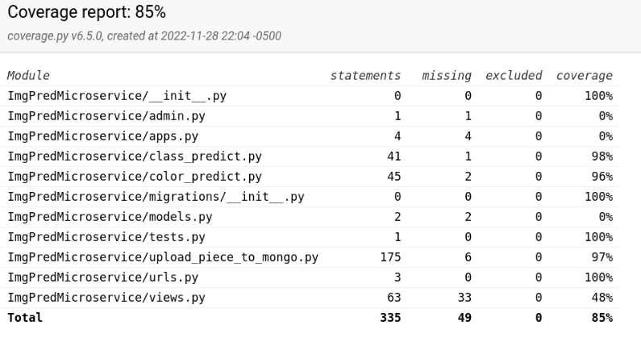

# Unit tests
For each method, one or more test cases.

A test case consists of input parameter values and expected results.

All external classes should be stubbed using mock objects.
## FF Mongo Driver Unit Tests
This test suite (located at test_mongo_handler.py) contains all of the tests necessary to test whether we are able to perform CRUD actions on items in `UserFashionPiece` collection and items in the `LabeledFashionPiece` collection. It also tests the Mongo aggregation pipelines which provide the logic for recommendations.

### Tests
* `test_create_and_insert_user_piece` 
  * Tests that wer can create a Mongo doc representing a fashion piece and upload it
* `test_create_insert_and_get_user_piece` 
  * Tests that we can retrieve an uploaded mongo doc representing a fashion piece.
* `test_create_user_piece` 
  * Test that we can create a local copy of a mongo doc representing a fashion piece.
* `test_get_complementary_clothing_types` 
  * Tests the mapping for clothing suggestions, so that, for example, "Jackets" are not recommended when the input class is "Cardigan"
* `test_get_complementary_recommendations` 
  * Tests the MongoDB aggregation for complementary recommendations
* `test_get_dominant_color` 
  * Tests the helper function that determines which of the palette colors is the "dominant" color
* `test_get_matching_color_list` 
  * Tests the helper function which performs the K-nearest-neighbors calculation
* `test_get_recommendations` 
  * Tests the MongoDB aggregation for similar item recommendations
* `test_get_wardrobe` 
  * Tests the MongoDB query for getting fashion pieces belonging to a user.

## FF Img Pred Class Service Unit Tests
This test suite (located at test_ff_img_pred_class_service.py) contains all of the tests necessary to test whether the model is properly hosted by the image prediction microservice. It also tests the helper functions of the class, ensuring that the colors and classes that are output are matching what is expected.
### Tests
* `test_binarizeOutput`
  * Tests the helper function that converts the probability vector into a label vector. Expected result is binary array matching input based on threshold of 0.5
* `test_binarizeOutputCustomThreshold`
  * Tests the helper function that converts the probability vector into a label vector using a custom threshold. Expected result is binary array matching input based on custom threshold.
* `test_hex_to_rgb_red`
  * Tests the helper function for converting between hex and rgb, parameterized for red input. Expected result is the correct hex code for the inputted RGB tuple.
* `test_hex_to_rgb_blue`
  * Tests the helper function for converting between hex and rgb, parameterized for blue input.  Expected result is the correct hex code for the inputted RGB tuple.
* `test_hex_to_rgb_green`
  * Tests the helper function for converting between hex and rgb, parameterized for green input.  Expected result is the correct hex code for the inputted RGB tuple
* `test_predict_class`
  * Tests the prediction function that takes in a filepath and outputs predicted labels. Expected result is a list of classes that the image belongs to.

## FF Img Pred Color Service Unit Tests
This test suite (located at test_ff_img_pred_color_service.py) contains all of the tests necessary to test the palette detection algorithm.
### Tests
* `test_get_dominant_colors`
  * Tests the function that predicts palettes for images. Expected result is a hex code that is close to the dominant color.
* `test_get_draw` 
  * Tests the helper function that makes a selection of pixels for palette dection. Expected result is a list of ints representing pixel positions.
* `test_get_flattneed_gaussian_kernel` 
  * Tests the function that generates a flattened gaussian kernel for use in `get_draw()` function. Expected result is a numpy array of size (n,m,3). The sum of all elements in that array must sum to 1. 
* `test_get_gaussian_kernel` 
  * Tests the function that generates a 2D gaussian kernel. Expected result is a numpy array of size (n,m,3) with a "hump" in the center of the photo.
* `test_knn_for_color_list` 
  * Test the helper function for running k-Nearest Neighbrors. Expected result is a list of 3 RGB tuples, representing the cluster centroids.
* `test_rgb_to_hex_red` 
  * Test the helper function for converting between rgb and hex codes. Parameterized for red. Expected result is the correct hex code for the inputted RGB tuple.
* `test_rgb_to_hex_blue` 
  * Test the helper function for converting between rgb and hex codes. Parameterized for blue. Expected result is the correct hex code for the inputted RGB tuple.
* `test_rgb_to_hex_green` 
  * Test the helper function for converting between rgb and hex codes. Parameterized for green. Expected result is the correct hex code for the inputted RGB tuple.

## Coverage

### Fashion Finder App coverage

Notably, most of the missing coverage comes from deprecated Django forms and utilities that are not used in the web-app.

### Fashion Finder Img Pred Microservice Coverage

The testing suite acheived 85% coverage for the prediction microservice